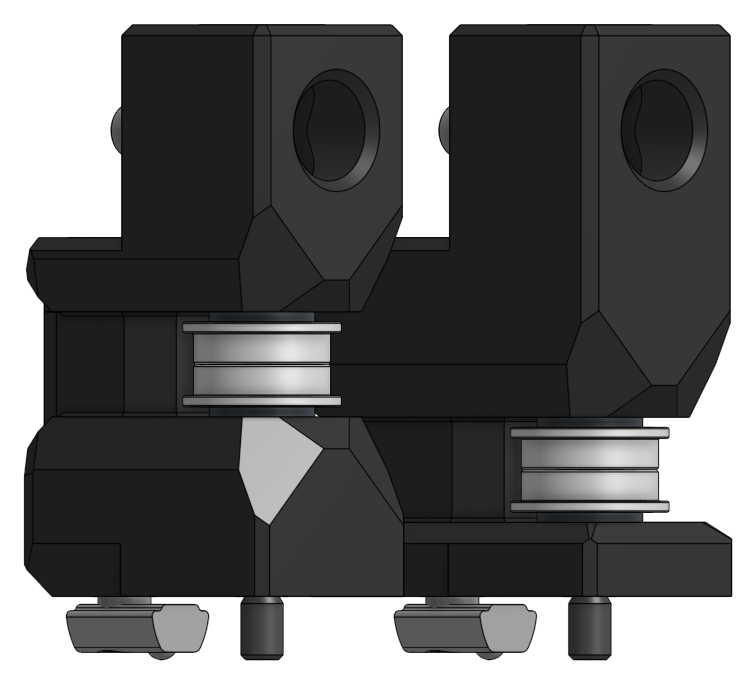

# AB - Drives

### BOM
2x  Nema 17 
2x  20T pulley  
2x  Hex key M4 inner M5 outer   
2x  5mm shoulder screw 30mm long    
2x  5mm shoudler screw 25mm long    
2x  M5x12 ISO 7380  
2x  M5x8 ISO 7380   
2x  M5x20 ISO 7380  
2x  M5 secure nut   
2x  M5 T-Nut  
2x  M5 washer (tensioner)   
12x heat insert 4mm long    
8x  M3 washer   
10x M3x30 SHCS  
10x M3x35 SHCS  
2x  M3 T-Nut    
2x  M4 T-Nut
12x F695 bearing    

Washer  
14x M5 1mm  
or  
8x M5 1mm   
8x M5 0.5mm 

  

# XY - Joints

### BOM

4x  30mm pin 5 mm   
2x  20t gates idler 
10x heat inserts 4 mm long  
8x  M3x8 SHCS   
6x  M3x25 SHCS  
4x  M3x30 SHCS  
6x  M5x10 ISO 7380  
6x  M5 T-Nut    
4x  F695 bearing    

Washer  
4x  M5  1 mm    
or  
4x  M5  0.5 mm  
2x  M5  1 mm    

# Front Idler

### BOM

2x  5mm shoulder screw 30mm long  
2x  M5x12 ISO 7380  
2x  M5x35   ISO 7380
2x  M5 T-Nut

Washer  
4x  M5  1 mm    
or  
4x  M5  0.5 mm  
2x  M5  1 mm  
