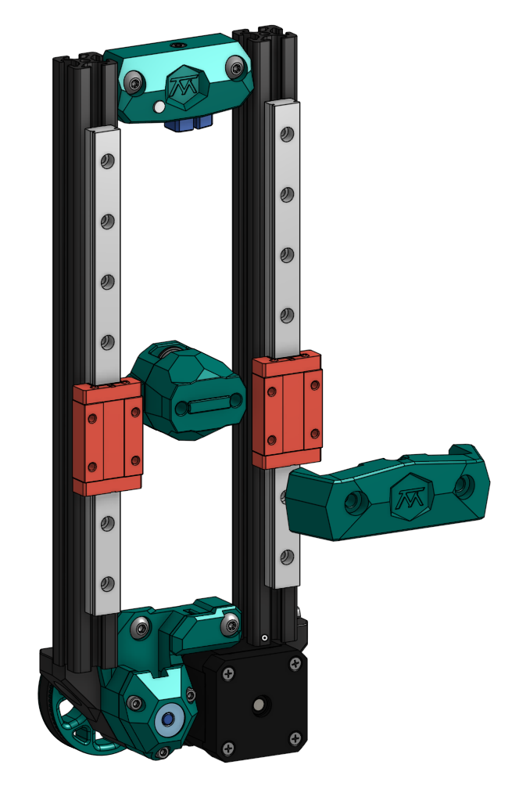

# Z - Drive

### BOM

Quantity	Part number	Description     

    1	GT2 20T deflanged pulley	    
    3	Bearing 625-2RS	    
    2	GT2 20T pulley (4:1)	    
    5	M5 1mm washer	    
	2	M3 1mm washer	    
	2	M3x16	    
	1	M3x12	    
	1	Nema 17	    
	1	Loop Belt 188T	    
	3	M3x40	DIN 912 M3x40   
	3	heat insert M3x5.0x4.0	heat set threaded insert    
	1	M5x8    
	2	M5x10	ISO 7380-1 M5x10    
	6	M5 T-Nut	M5 T-Nut    
	1	65mm Pin M5	    
	3	ISO 7380-1 M5x20	    
	1	GT2 16T pulley (5:1)	    
	2	M5 T-Nut	M5 T-Nut    
	1	M3x30	DIN 912 M3x30   
	1	M3 Nut	DIN 934 M3 Nut  
	1	GT2 20T idler	    
	1	20mm Pin M5	    
	4	F695 2RS	    
	1	D2F-5L	Omron Mouse Button - Micro Switch   
	2	30mm Pin M5	    
	2	ISO 7380-1 M5x40	    
